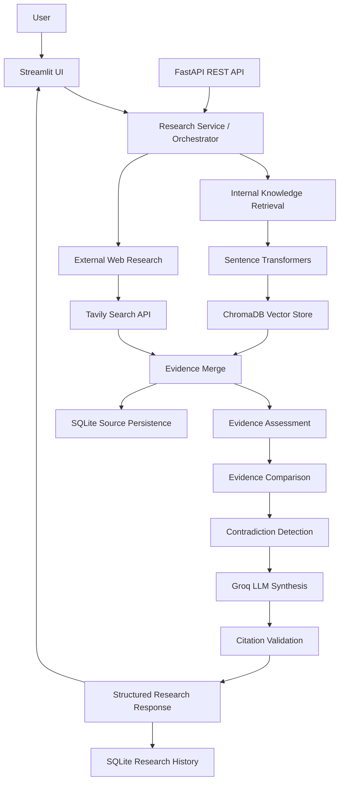

# Enterprise AI Research Agent

A structured enterprise research application built for the **MODUS Enterprise AI Build Challenge – Assignment 9: Enterprise AI Research Agent**.

The application accepts a business research question, retrieves relevant internal knowledge, searches external web sources, stores supporting evidence, compares sources, detects contradictions, generates grounded conclusions, validates citations, and maintains traceable research history.

This is designed as an **enterprise research pipeline**, not a generic chatbot with web search.

---

## Live Demo

**Streamlit Cloud**

https://build-enterprise-ai-research-agent-chhcsgdgvwgtytvhckfnxs.streamlit.app/

---

## Key Capabilities

- Streamlit research interface
- FastAPI backend/API layer
- Internal Retrieval-Augmented Generation (RAG)
- Dynamic external web research using Tavily
- SentenceTransformer embeddings
- Chroma vector database
- Internal + external evidence merging
- Evidence-confidence assessment
- Explicit multi-source evidence comparison
- Contradiction detection
- Groq LLM structured synthesis
- Pydantic structured outputs
- Deterministic citation-ID validation
- Weak-evidence safe fallback
- Persistent SQLite research history
- Persistent source metadata and evidence
- Source URL and source-type traceability
- Research IDs for request-level traceability
- Logging and latency measurement
- Automated RAG evaluation suite
- Pytest unit tests
- Streamlit Cloud deployment

---

## Challenge Pipeline

```text
Define Research Question
        ↓
Search Sources
        ↓
Collect Information
        ↓
Store Sources
        ↓
Extract Evidence
        ↓
Compare Evidence
        ↓
Assess / Classify Findings
        ↓
Detect Contradictions
        ↓
Generate Conclusions
        ↓
Validate Citations
        ↓
Maintain Traceability
```

---

## System Architecture



### Architecture explanation

The user submits a research question through Streamlit. The research orchestrator retrieves relevant internal knowledge from ChromaDB using SentenceTransformer embeddings while also searching external sources through Tavily.

The internal and external evidence are merged into a unified evidence package with citation IDs. The backend evaluates evidence quality, explicitly compares sources, detects contradictions, and passes the grounded evidence package to Groq for structured synthesis.

The generated response is validated to ensure that every citation ID actually exists in the supplied evidence. Research history and supporting source metadata are stored in SQLite for persistence and traceability.

The Streamlit deployment currently calls the shared research service directly. FastAPI exposes the same service layer as a REST API, allowing another frontend or enterprise system to integrate without rewriting the research pipeline.

---

## Architecture Layers

| Layer | Implementation |
|---|---|
| User Interface | Streamlit |
| API Layer | FastAPI |
| Research Orchestration | `research_service.py` |
| Internal Retrieval | ChromaDB |
| Embeddings | SentenceTransformers |
| External Research | Tavily |
| Evidence Merge | `evidence_merge_service.py` |
| Evidence Assessment | `evidence_service.py` |
| Evidence Comparison | `evidence_comparison_service.py` |
| Contradiction Detection | `contradiction_service.py` |
| LLM Generation | Groq |
| Structured Validation | Pydantic |
| Citation Validation | `validation_service.py` |
| Research History | SQLite |
| Source Persistence | SQLite |
| Configuration | `.env` / Streamlit Secrets |
| Observability | Python logging + latency tracking |

---

## End-to-End Research Flow

### 1. User enters a research question

Example:

```text
How is AI predictive maintenance changing manufacturing?
```

### 2. Internal semantic retrieval

```text
Query
  ↓
Embedding
  ↓
Chroma similarity search
  ↓
Relevant internal chunks
```

Internal evidence can include:

```text
citation_id
source_id
source_name
source_type
chunk_id
semantic distance
industry
document_type
```

### 3. External web research

```text
Research Question
      ↓
Tavily Search
      ↓
Relevant public sources
      ↓
Title + URL + evidence text
```

External sources are converted into the same evidence structure used by internal retrieval.

### 4. Evidence merge

Internal and web evidence are combined and assigned unified citation IDs such as:

```text
S1
S2
S3
S4
S5
S6
```

### 5. Evidence assessment

The system evaluates evidence strength before generation.

Internal semantic distance is used only for internal vector-store evidence. Web evidence is not assigned a fabricated Chroma distance.

Possible levels:

```text
High
Medium
Low
```

If evidence is too weak, the system returns a safe limitation instead of generating unsupported conclusions.

### 6. Evidence comparison

The application performs a separate comparison stage before final synthesis.

Example:

```text
Topic:
Use of sensor data in predictive maintenance

Supporting sources:
S1, S4

Comparison:
Both sources describe the use of sensor data and analytics
to detect anomalies and support proactive maintenance.
```

Comparison citation IDs are validated against the actual evidence set.

### 7. Contradiction detection

A separate service checks whether sources make genuinely incompatible claims.

If no genuine contradiction exists:

```json
{
  "contradictions": []
}
```

### 8. Structured LLM synthesis

Groq receives:

```text
Research Question
+
Raw Evidence
+
Evidence Comparisons
+
Contradiction Analysis
```

The LLM is instructed to use only supplied evidence, never invent citation IDs, communicate uncertainty when sources conflict, and return structured JSON.

### 9. Citation validation

If the available evidence is `S1` through `S6` and the model invents `S99`, the response fails deterministic citation validation and is regenerated.

### 10. Persistence and traceability

Each research run receives a UUID `research_id`.

The main result is stored in `research_history`, while supporting evidence is stored in `research_sources`.

---

## Persistent Data Model

### `research_history`

| Field | Purpose |
|---|---|
| `research_id` | Unique research-run identifier |
| `query` | Original research question |
| `summary` | Generated research summary |
| `confidence_level` | High / Medium / Low |
| `confidence_explanation` | Evidence-confidence explanation |
| `created_at` | Creation timestamp |

### `research_sources`

| Field | Purpose |
|---|---|
| `id` | SQLite row ID |
| `research_id` | Links evidence to a research run |
| `citation_id` | Citation such as `S4` |
| `source_id` | Internal ID or web URL |
| `source_name` | Human-readable source title |
| `source_type` | `internal` or `web` |
| `source_url` | Public URL for web evidence |
| `evidence_text` | Exact evidence used by the pipeline |
| `created_at` | Persistence timestamp |

---

## Project Structure

```text
enterprise-ai-research-agent/
│
├── .streamlit/
│   └── config.toml
│
├── app/
│   ├── __init__.py
│   ├── main.py
│   ├── api/
│   │   ├── health.py
│   │   ├── history.py
│   │   └── research.py
│   ├── config/
│   │   ├── database.py
│   │   ├── logging_config.py
│   │   └── settings.py
│   ├── models/
│   │   ├── contradiction.py
│   │   ├── document.py
│   │   ├── evidence.py
│   │   ├── evidence_comparison.py
│   │   ├── exceptions.py
│   │   ├── history.py
│   │   ├── llm.py
│   │   ├── research.py
│   │   ├── validation.py
│   │   └── web_source.py
│   ├── prompts/
│   │   ├── contradiction_prompt.py
│   │   ├── evidence_comparison_prompt.py
│   │   └── research_prompt.py
│   ├── repositories/
│   │   └── research_repository.py
│   └── services/
│       ├── chunking_service.py
│       ├── contradiction_service.py
│       ├── document_service.py
│       ├── embedding_service.py
│       ├── evidence_comparison_service.py
│       ├── evidence_merge_service.py
│       ├── evidence_service.py
│       ├── llm_service.py
│       ├── research_service.py
│       ├── retrieval_service.py
│       ├── validation_service.py
│       ├── vector_store_service.py
│       └── web_research_service.py
│
├── data/
│   ├── manufacturing_ai.txt
│   ├── chroma_db/
│   └── research_history.db
│
├── evals/
│   ├── evaluation_questions.json
│   └── run_evaluation.py
│
├── tests/
│   ├── test_chunking_service.py
│   ├── test_evidence_service.py
│   ├── test_repository.py
│   └── test_validation_service.py
│
├── ui/
│   └── streamlit_app.py
│
├── .env.example
├── .gitignore
├── requirements.txt
└── README.md
```

---

## Technology Stack

| Technology | Purpose |
|---|---|
| Python | Core implementation |
| FastAPI | REST API layer |
| Streamlit | Interactive frontend |
| Pydantic | Request/response and LLM schema validation |
| SentenceTransformers | Embeddings |
| ChromaDB | Internal vector retrieval |
| Tavily | External web research |
| Groq | LLM inference |
| SQLite | Research/source persistence |
| Pytest | Unit testing |
| python-dotenv | Local configuration |
| Uvicorn | FastAPI server |

---

## Configuration

Create a `.env` file:

```env
GROQ_API_KEY=your_groq_api_key
GROQ_MODEL=openai/gpt-oss-20b
TAVILY_API_KEY=your_tavily_api_key
```

Do **not** commit `.env`.

For Streamlit Cloud, use Streamlit Secrets:

```toml
GROQ_API_KEY = "your-key"
GROQ_MODEL = "openai/gpt-oss-20b"
TAVILY_API_KEY = "your-key"
```

---

## Installation

```bash
git clone <repository-url>
cd enterprise-ai-research-agent

python -m venv venv
source venv/bin/activate

pip install -r requirements.txt
```

On Windows:

```bash
venv\\Scripts\\activate
```

---

## Running Locally

### Streamlit

```bash
streamlit run ui/streamlit_app.py
```

### FastAPI

```bash
uvicorn app.main:app --reload
```

---

## Example Research Query

```text
How is AI predictive maintenance changing manufacturing?
```

Typical flow:

```text
Question
↓
Internal Chroma Retrieval
↓
Tavily Web Research
↓
Evidence Merge
↓
Evidence Assessment
↓
Evidence Comparison
↓
Contradiction Detection
↓
Groq Structured Synthesis
↓
Citation Validation
↓
SQLite Persistence
↓
Structured Research Report
```

---

## Reliability Features

- Retrieval-Augmented Generation
- structured Pydantic validation
- bounded retry logic
- retry handling for malformed evidence-comparison JSON
- deterministic citation validation
- weak-evidence rejection
- safe fallback behavior
- evidence comparison
- contradiction detection
- persistent research history
- persistent research sources
- source URLs for web evidence
- evidence-confidence scoring
- request-level research IDs
- logging and latency measurement

---

## Observability

The backend logs information such as:

```text
research_id
query
industry
retrieval latency
internal evidence count
web evidence count
citation IDs
source type
source name
semantic distance
evidence confidence
comparison count
contradiction count
LLM latency
citation-validation result
total latency
```

---

## Evaluation

The current RAG evaluation suite contains **8 cases** and produced **8/8 successful evaluation results** in the current project configuration.

Evaluation focuses on:

- relevant evidence retrieval
- supported-query response generation
- weak-evidence fallback
- citation validity
- confidence behavior

---

## Unit Testing

Pytest tests cover:

```text
chunking
evidence assessment
repository behavior
citation validation
```

The latest local run was **not fully green**; chunking-test cleanup remains. Run:

```bash
pytest
```

---

## Persistence Verification

Persistence was verified by:

```text
Run research
↓
Save supporting sources
↓
Exit Python
↓
Restart Python
↓
Load same research ID
↓
Recover internal + web sources
```

---

## Security

Current MVP protections include:

- Pydantic input validation
- environment-based secrets
- Streamlit Secrets
- retrieved evidence treated as untrusted source data
- structured LLM output validation
- deterministic citation validation
- no committed API keys

Production improvements should include authentication, RBAC, tenant isolation, document-level authorization, rate limiting, HTTPS, audit logging, managed secrets, and centralized monitoring.

---

## Deployment

### Hosted Streamlit demo

https://build-enterprise-ai-research-agent-chhcsgdgvwgtytvhckfnxs.streamlit.app/

Streamlit entry point:

```text
ui/streamlit_app.py
```

The hosted deployment uses Python 3.11 and Streamlit Secrets.

### API architecture

FastAPI remains available for REST-based integrations:

```text
FastAPI
   ↓
Research Service
```

Both Streamlit and FastAPI reuse the same core research logic.

---

## Production Architecture

Potential production replacements:

| MVP | Production |
|---|---|
| SQLite | PostgreSQL |
| Local Chroma | Managed vector DB / pgvector |
| Local files | Object storage |
| Streamlit demo | Enterprise web frontend |
| `.env` / Streamlit Secrets | Cloud secrets manager |
| Console logs | Centralized observability |
| No authentication | SSO + RBAC |
| Single instance | Horizontally scaled services |

---

## Scalability

The architecture separates UI, API, orchestration, retrieval, external research, comparison, contradiction analysis, generation, validation, and persistence.

For larger ingestion:

```text
Document
   ↓
Object Storage
   ↓
Queue
   ↓
Background Worker
   ↓
Chunk
   ↓
Embed
   ↓
Shared Vector Database
```

---

## Explainability and Traceability

For each research run the application can retain:

```text
Research ID
Question
Evidence
Citation IDs
Source names
Source types
Source URLs
Confidence
Generated findings
```

This allows an evaluator to inspect why the system reached its conclusions.

---

## Current Limitations

- Internal knowledge base is currently small and manufacturing-focused.
- Repeated indexing can produce duplicate internal chunks; retrieval deduplication can be improved.
- Tavily currently provides search-result evidence rather than a full web-crawling pipeline.
- Full source-authority scoring is not implemented.
- Citation validation checks citation existence but not complete semantic entailment.
- Evidence thresholds are calibrated for the current dataset and embedding model.
- Local Chroma is intended for MVP use.
- SQLite is appropriate for challenge/local persistence but not high-scale multi-user production.
- Authentication and RBAC are not implemented.
- Full multi-tenancy is not implemented.
- Full document versioning is not implemented.
- Chunking unit-test cleanup remains.

---

## Future Improvements

- duplicate-evidence removal
- source-quality scoring
- domain trust ranking
- full-page web extraction
- freshness scoring
- hybrid semantic + keyword retrieval
- reranking
- richer contradiction evaluation
- persisted web knowledge re-indexing
- stable source IDs
- document versioning
- Recall@K / Precision@K
- groundedness scoring
- human-reviewed evals
- LLM-as-a-judge evaluation
- authentication and RBAC
- PostgreSQL
- managed vector database
- object storage
- asynchronous ingestion
- LLM-provider fallback
- rate limiting
- centralized monitoring

---

## Model and Service Inventory

| Component | Current Choice | Purpose |
|---|---|---|
| Embedding Model | `all-MiniLM-L6-v2` | Semantic retrieval |
| LLM | `openai/gpt-oss-20b` through Groq | Structured synthesis and evidence analysis |
| Search | Tavily | Dynamic external research |
| Vector Store | ChromaDB | Internal evidence retrieval |
| Relational Store | SQLite | Research/source persistence |
| UI | Streamlit | Interactive demo |
| API | FastAPI | REST integration |
| Validation | Pydantic | Structured schemas |
| Testing | Pytest | Unit testing |

A separate submission document should provide exact package/library licence details.

---

## AI-Assisted Development Disclosure

AI coding assistance was used for architecture planning, code drafting/refactoring, debugging, test planning, documentation, and demo preparation.

All design choices, code paths, validation logic, deployment steps, limitations, and trade-offs should remain personally explainable during technical validation.

---

## Suggested Live Demo

1. Open the Streamlit application.
2. Enter a new enterprise research question.
3. Show internal and web evidence being collected dynamically.
4. Show source names and citation IDs.
5. Explain evidence comparison.
6. Explain contradiction detection.
7. Show structured findings/opportunities/risks.
8. Show confidence and source traceability.
9. Show persisted research history.
10. Explain the FastAPI integration path.
11. Explain MVP limitations and the production scaling path.

---

## Summary

The Enterprise AI Research Agent demonstrates:

```text
Dynamic Research
Internal RAG
External Search
Evidence Storage
Evidence Comparison
Contradiction Detection
Grounded Generation
Structured Output
Citation Validation
Confidence Assessment
Persistent Traceability
Observability
Evaluation
Cloud Deployment
```

The focus is not simply on generating an answer. The application demonstrates the full path from **question → evidence → comparison → validation → persistent, traceable conclusion**.
